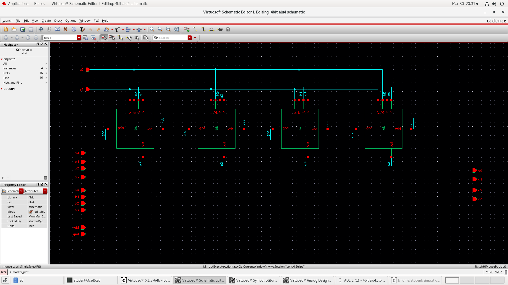
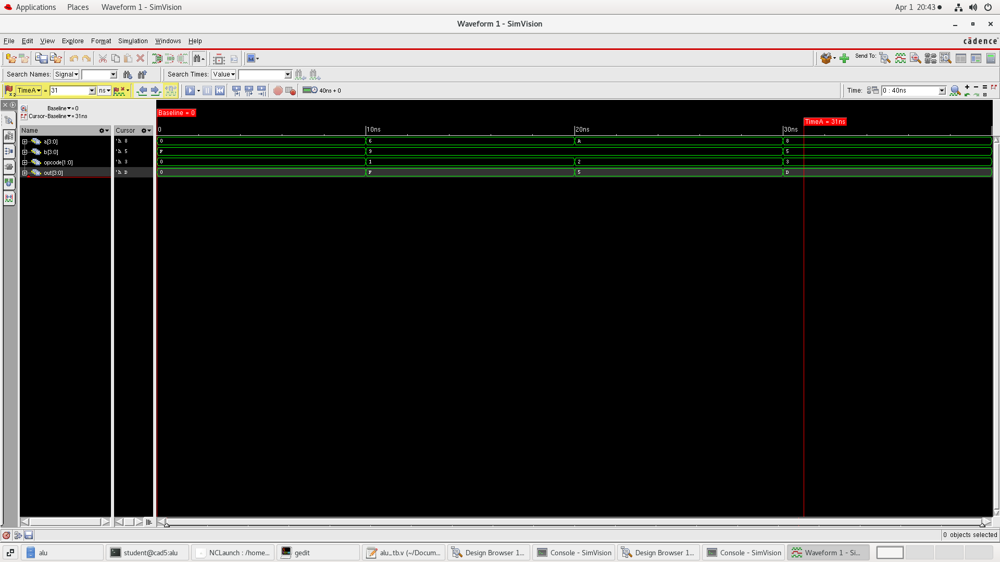
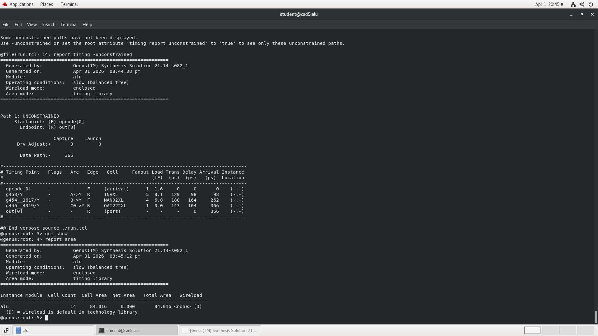
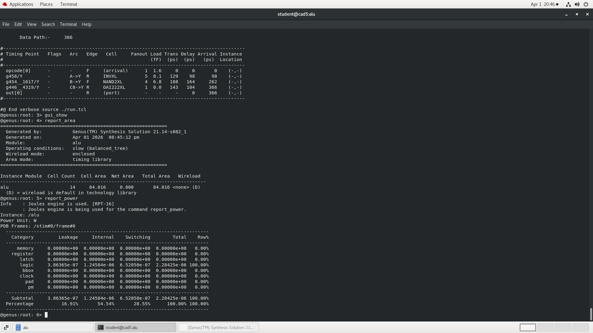
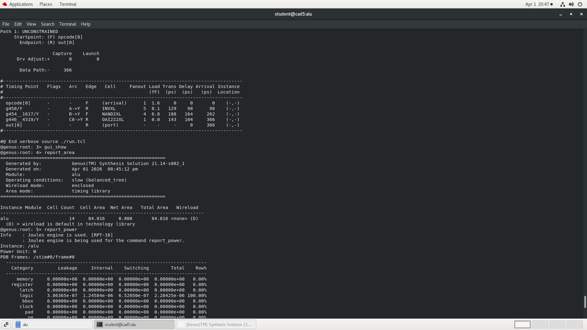

# 🔷 4-bit ALU Design (RTL to Layout)

## 📌 Overview

This project implements a 4-bit ALU using Verilog and Cadence tools.
The design includes schematic-level implementation, simulation, and synthesis analysis.

---

## ⚙️ Features

* 1-bit ALU using AND, OR, XOR, NOT gates
* 4-bit ALU built using 1-bit blocks
* Verilog RTL implementation
* Cadence Virtuoso schematic design
* Synthesis using Cadence Genus

---

## 📂 Files

* alu.v → RTL design
* alu_tb.v → Testbench
* schematic.png → Design schematic
* waveform.png → Simulation waveform
* area.png → Area report
* power.png → Power report
* timing.png → Timing report

---

## 📷 Results

### Schematic

### Waveform

---

## 📊 Synthesis Results

### Area

### Power

### Timing

---

## 🛠 Tools Used

* Verilog HDL
* Cadence Virtuoso
* Cadence Genus

---

## 👨‍💻 Author
Bhavitha N
