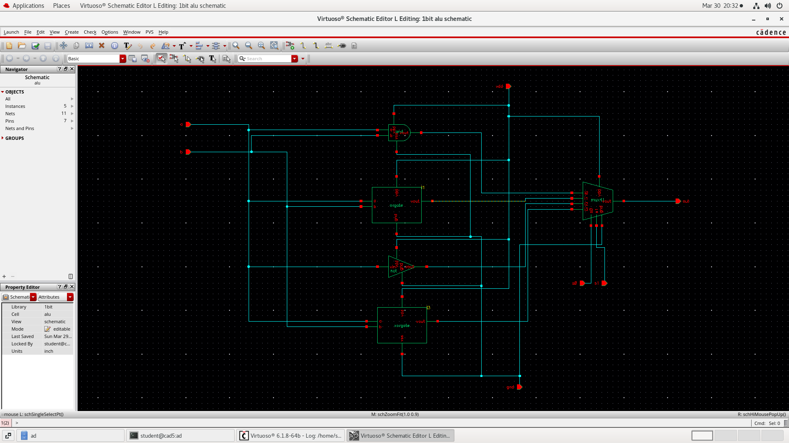
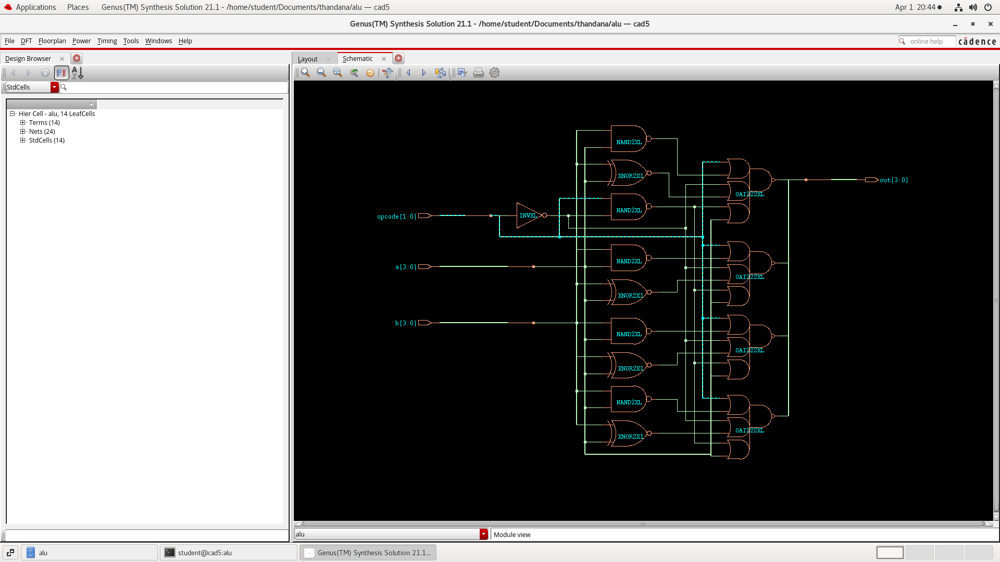
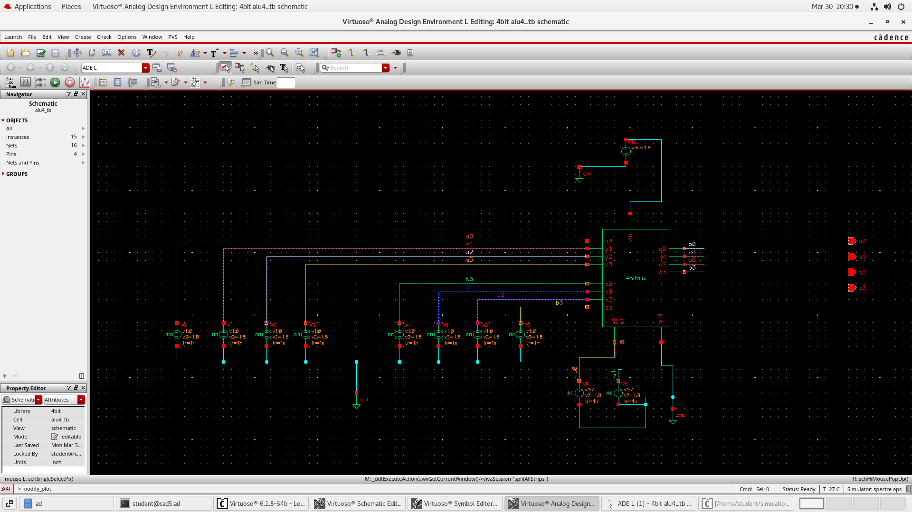
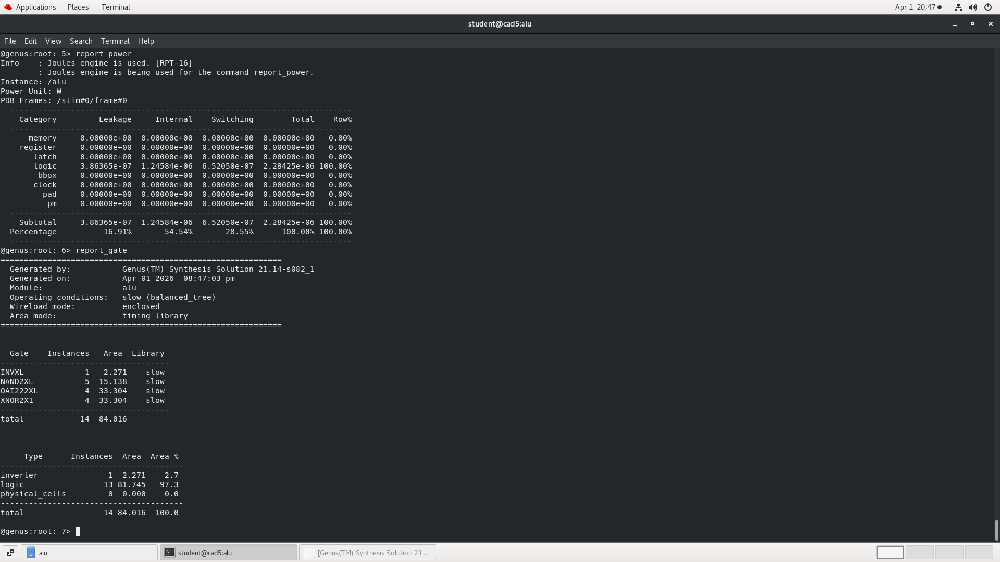
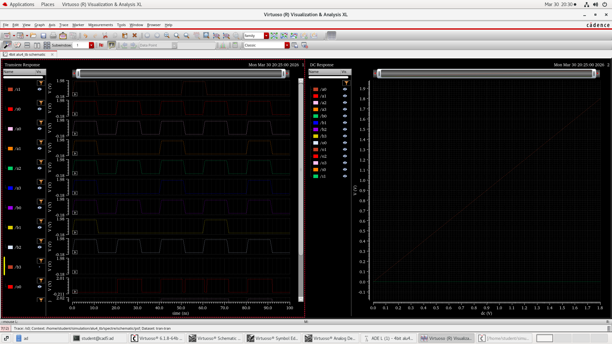
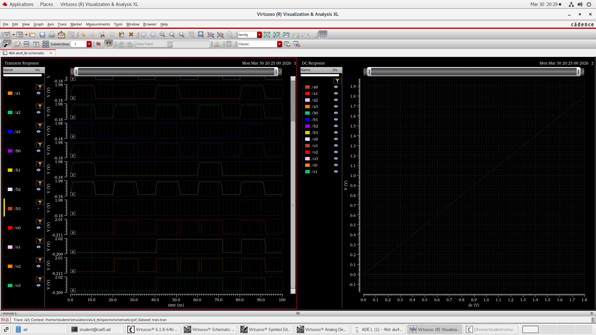

# 🔷 4-bit ALU Design (RTL to Layout)

## 📌 Overview

This project implements a **4-bit Arithmetic Logic Unit (ALU)** using both **Verilog (RTL)** and **Cadence Virtuoso (schematic design)**.

The design follows a complete VLSI flow:

* Gate-level design (1-bit ALU)
* Hierarchical design (4-bit ALU)
* RTL implementation
* Simulation & waveform verification
* Synthesis (area, power, timing)

---

## ⚙️ Features

* 1-bit ALU using:

  * AND, OR, XOR, NOT gates
  * Multiplexer-based selection
* 4-bit ALU built using 1-bit ALU blocks
* Supports multiple operations:

  * Addition
  * Subtraction
  * AND
  * OR
* Fully verified using:

  * Cadence Virtuoso (schematic)
  * Simulation waveforms
  * Synthesis reports

---

## 🧠 Design Architecture

### 🔹 1-bit ALU

* Built using basic logic gates
* Multiplexer selects operation
* Forms building block of 4-bit ALU

### 🔹 4-bit ALU

* Combination of four 1-bit ALUs
* Handles 4-bit input operations

---

## 📂 Project Structure

```
alu-project/
│
├── verilog/
│   ├── alu.v
│   └── alu_tb.v
│
├── cadence/
│   ├── 1bit/
│   │   ├── schematic.png
│   │   └── waveform.png
│   │
│   ├── 4bit/
│   │   ├── schematic.png
│   │   └── waveform.png
│
├── synthesis/
│   ├── area.png
│   ├── power.png
│   ├── timing.png
│   └── gate.png
│
└── README.md
```

---

## 📷 Results

### 🔹 1-bit ALU Schematic



### 🔹 4-bit ALU Schematic


### Synthesis 



### Testbench



### Symbol


### 🔹 Simulation Waveform


---

## 📊 Synthesis Results

### Area Report


### Power Report


### Gate Report



### analog_waveform



### analog_waveform



---

## 🔬 Tools Used

* Cadence Virtuoso
* Cadence Genus (Synthesis)
* Verilog HDL

---

## 📌 Conclusion

This project demonstrates a complete digital design flow from:

* Basic gate-level design
  → RTL implementation
  → Simulation
  → Synthesis analysis

It highlights hierarchical design and practical VLSI implementation.

---

## 👨‍💻 Author

Bhavitha N
